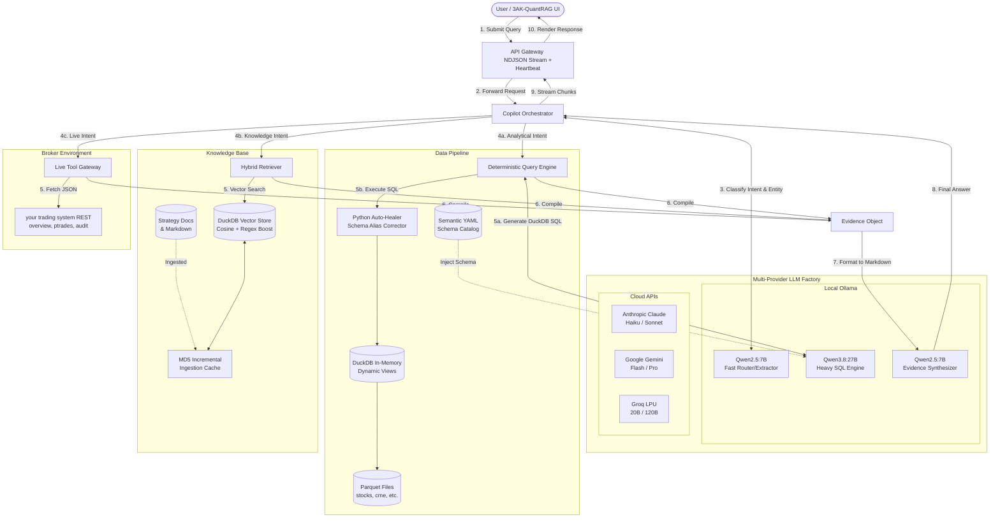

# 3AK-QuantRAG: Deterministic AI for Quantitative Finance

**Status:** Active / Production-Ready  
**Version:** 2.0  
**Date:** 2026-09-13  
**Author:** [Akash Katare](https://www.linkedin.com/in/akash-katare)  
**Email:** [akash.dglass@gmail.com](mailto:akash.dglass@gmail.com)  
**Primary Goal:** Serve as a deterministic, natural-language intelligence layer over your trading ecosystem. It strictly enforces correctness, safety, and evidence-backed provenance without weakening the independence of the underlying quantitative system.

---

## 1. Executive Summary

### Why Standard RAG Fails for Quantitative Finance
Standard RAG frameworks (like naive LangChain or LlamaIndex) are built for unstructured text. However, financial data is fundamentally structured, tabular, and heavily mathematical (aggregations, sorting, ratios). LLMs are notoriously terrible at math and spatial reasoning. If you push all your market data into a Vector Database and ask an LLM to "figure it out", it will hallucinate metrics, leading to catastrophic financial inferences.

3AK-QuantRAG solves this by establishing a **"Correctness over Cleverness"** paradigm. It completely bans the LLM from calculating metrics. Instead, the system forces the LLM to generate strict deterministic DuckDB SQL, executes the SQL against raw tabular data, and traps the LLM inside a structured JSON `Evidence Object`.

A useful mental model is:

> **3AK-QuantRAG = LLM + Query Planning + Knowledge Retrieval + Analytical Engine + Live Tools + Evidence**


The first release should be **read-only**. It should answer questions, explain your trading system's own logic, analyze data, and surface evidence. Any future write/action capability should be introduced as a separate, explicitly approved tool layer.

### Target experience

A user should be able to ask questions such as:
- "What exactly is the MIP8 entry rule?"
- "Why did this stock qualify for the scanner yesterday?"
- "Show me the 20-day forward return for stocks with RVol > 2 and a >4% move."
- "Which stocks currently satisfy the VCP criteria?"
- "What was the market regime when this strategy underperformed?"
- "What does your trading system know about RELIANCE today?"
- "Why did the system not take this trade?"

The important distinction is that 3AK-QuantRAG should return **answers with provenance**, not merely fluent answers.

---

# 2. Design Principles

## 2.1 Correctness over cleverness
3AK-QuantRAG is a financial/trading intelligence system. A plausible but incorrect answer is worse than "I don't have enough evidence."
The system prefers:
1. Exact data queries over LLM calculations.
2. Source evidence over model memory.
3. Deterministic business logic over inferred rules.
4. Reproducible queries over opaque reasoning.

## 2.2 Source of Truth Hierarchy
When resolving a query, 3AK-QuantRAG must explicitly respect the following hierarchy of truth:
1. **Live system state/API** (Ground truth of what is happening right now)
2. **Canonical structured strategy/metric definitions** (Machine-readable YAML rules)
3. **Curated analytical views** (DuckDB SQL queries over Parquet)
4. **Versioned documentation** (Markdown Architecture / Strategy docs)
5. **Research notes / logs** (Contextual, but subordinate to canonical docs)
6. **LLM inference** (Fallback, lowest priority, explicitly labeled as inference)

## 2.3 Truth vs Interpretation
3AK-QuantRAG should internally distinguish and explicitly label information before presenting it to the user. These are not equivalent:
- **FACT:** RELIANCE close = ₹1,487
- **CALCULATION:** RVol20 = 1.87
- **RULE EVALUATION:** RVol requirement = PASS
- **STATISTICAL RESULT:** Historical 20D positive-return probability = 63%
- **INTERPRETATION:** This suggests stronger-than-normal participation.
- **OPINION / INFERENCE:** The setup appears attractive.

## 2.4 Evidence-first responses
Every substantive answer should know where it came from.
For example:
> **Answer:** RELIANCE had RVol20 = 1.87 on 2026-08-27.
> **Evidence:** `stocks` table → 2026-08-27 → RELIANCE → `volume / vol_avg_20`.

## 2.5 Read-only by default
The initial 3AK-QuantRAG system must have read-only access across the filesystem, DuckDB, and API tools. No arbitrary shell execution or direct broker order capability.

---

# 3. High-Level Architecture



### 3.1 Step-by-Step Execution Flow

The numbered edges in the diagram trace the strict multi-agent execution pipeline:

1. **[1-2] Query Submission:** The user's query hits the Flask API Gateway, which opens an NDJSON stream (sending Keep-Alive heartbeats) and forwards the prompt to the stateless `CopilotOrchestrator`.
2. **[3] Fast Intent Routing:** The Orchestrator delegates to a fast LLM (e.g., `Qwen2.5:7B`) to classify the request's intent and extract any target entities (like dataset names).
3. **[4] Tool Delegation:** Based on the intent, the Orchestrator strictly routes the prompt to either the Deterministic Query Engine (Analytical), the Hybrid Retriever (Knowledge), or the Live Tool Gateway (Live API).
4. **[5] Isolated Execution:** The selected tool executes its specific logic. For analytical queries, this involves generating SQL via the heavy LLM (e.g., `Qwen3.8:27B`) and executing it securely in DuckDB through an Auto-Healer regex loop to repair structural schema errors.
5. **[6] Evidence Compilation:** The tool completes its task without generating conversational text, strictly returning a JSON-structured `EvidenceObject` representing the absolute ground-truth data.
6. **[7-8] Final Synthesis:** The Orchestrator passes the raw `EvidenceObject` back to a fast LLM. The model is rigidly prompted to translate the JSON into a conversational Markdown response without injecting external knowledge.
7. **[9-10] Streaming Response:** The synthesized chunks are streamed back through the API and rendered in the 3AK-QuantRAG UI as they are generated.

---

# 4. Core Components

## 4.1 Knowledge Base / RAG Architecture
- **Sources:** `docs/`, `context/`, `AGENT_CONTEXT.md`, `issues_log.md`, Strategy definitions.
- **Storage Format:** Embeddings are stored natively inside DuckDB as 1024-dimensional floating point arrays (`FLOAT[1024]`) alongside their raw text and JSON metadata in a single `kb_docs` table.
- **Hybrid Retrieval & Reading:** We use **DuckDB** with the official **`vss` (Vector Similarity Search)** extension. It reads the vectors directly via SQL using the `array_cosine_similarity(embedding, query_embedding)` function. To guarantee exact acronym matching (e.g., `ORB`, `MIP8`), the retriever dynamically parses the query for uppercase acronyms and injects a `CASE WHEN content ILIKE '%<KEYWORD>%'` SQL clause to instantly boost the semantic score natively within DuckDB. This completely eliminates the need for complex external vector databases (Chroma/LanceDB) while keeping the document index logically independent from the analytical tables.
- **MD5 Incremental Ingestion Cache:** Re-embedding large markdown files on every startup is computationally expensive. The ingestion script (`ingest_docs.py`) maintains an `ingest_hashes.json` state file. It computes an MD5 hash of each document and only triggers the HuggingFace embedding model if the file's structural content has actually changed, reducing update times from minutes to milliseconds.

## 4.2 Structured Data Architecture
- **DuckDB as Analytical Layer:** The LLM should never directly manipulate Parquet/CSV files. It creates a structured query plan, which is parsed, validated against an allow-list, dry-run (EXPLAIN), and executed on a Read-Only DuckDB connection.
- **Dynamic Dataset Mapping:** The system automatically scans the `data/parquet/` directory (e.g., `stocks.parquet`, `cme_stocks.parquet`, `delivery.parquet`) and dynamically mounts *all* available analytical files as active DuckDB views.
- **Schema Auto-Aliasing:** During view creation, the engine standardizes edge-case schemas automatically (e.g., injecting `key AS symbol` for `cme_stocks.parquet`). This creates a unified join fabric so the LLM can safely use `USING (symbol)` without crashing.
- **Contextual Schema Injection:** The system dynamically populates the LLM's system prompt with a list of all active table names and their specific YAML semantic schemas, empowering the LLM to write complex `JOIN` queries across datasets without hallucinating column names.
- **Auto-Healing Execution:** DuckDB queries are wrapped in a protective loop to automatically intercept and correct schema hallucinations (Detailed in Section 5.4).

## 4.3 The Semantic Data Catalog
A raw database schema is not enough. 3AK-QuantRAG needs a machine-readable semantic catalog in `context/`.
```yaml
metric: rvol20
definition: volume / previous_20_day_average_volume
unit: ratio
higher_is: stronger_volume
valid_range: ">= 0"
source_table: stocks
```

## 4.4 Strategy Knowledge Registry
Maintain a machine-readable strategy registry alongside prose documents to avoid LLMs misinterpreting rules.
```yaml
strategy: ORB
version: V1
entry:
  - strong_start
  - above_value_high_or_pdh
  - rvol_first_candle >= threshold
  - orb_breakout
```

## 4.5 Tool Gateway
Expose an allow-listed tool registry (e.g., `get_market_status`, `get_portfolio`) rather than arbitrary HTTP access.

## 4.6 The CopilotOrchestrator (Dual-Model Relay Race)
The `CopilotOrchestrator` is the central "brain" and entry point of the backend. Rather than relying on opaque framework agents, it is a custom, stateless Python controller designed for absolute deterministic execution.

**Why Dual-Model? (7B vs 27B)**
Using a massive 27B+ parameter model for every step of an agent loop is incredibly slow and expensive. Conversely, using a fast 7B model for complex SQL generation results in syntax errors. The Orchestrator solves this by treating inference like a relay race: it uses a lightning-fast 7B model to instantly extract intent, wakes up the heavy 27B model purely for structural SQL logic, and then hands the baton back to the 7B model for conversational formatting.

*Example User Query: "What was the total volume for RELIANCE yesterday?"*

1. **Fast LLM - Intent Routing:** The query is passed to a high-speed model (like Qwen 7B) to classify the request.
   - *Example Output:* `"analytical"`
2. **Fast LLM - Entity Extraction:** The fast model is prompted a second time to extract the specific target dataset, ensuring we only load the required schema.
   - *Example Output:* `"stocks"`
3. **Heavy LLM - SQL Generation:** The Orchestrator injects the extracted dataset's YAML schema into a powerful reasoning model (like Qwen 27B) to write complex DuckDB SQL.
   - *Example Output:* `"SELECT volume FROM 'data/parquet/stocks.parquet' WHERE symbol='RELIANCE' ORDER BY Date DESC LIMIT 1;"`
4. **Python/DuckDB - Execution:** (Zero LLM involvement). The raw SQL is executed against the local Parquet files, returning strict `EvidenceObject` instances.
   - *Example Output:* `[EvidenceObject: {result: 14500234, source: "stocks", confidence: "deterministic"}]`
5. **Fast LLM - Final Synthesis:** The Orchestrator delegates the pure formatting task back to the fast LLM to quickly translate the exact `EvidenceObject` into conversational markdown, completely eliminating hallucination while avoiding the heavy latency of the reasoning model.
   - *Example Output:* `"Based on the stocks dataset, the total volume for RELIANCE yesterday was 14,500,234 shares."`

## 4.7 Client-Side UI & Streaming (finchat.js)
The frontend UI is purpose-built to consume the Orchestrator's NDJSON output stream while maintaining the "Correctness over Cleverness" philosophy visually.
- **The Dual-Panel Layout:** The UI strictly separates the LLM's conversational Markdown output from the raw Data Engine output. A dedicated "Evidence Panel" allows the user to inspect the exact DuckDB SQL and JSON `EvidenceObject` that generated the answer, providing visual proof of provenance.
- **Heartbeat Tolerance:** To prevent standard browser HTTP timeouts when the heavy `qwen3.8:27b` model is crunching complex SQL locally for >100 seconds, the frontend stream parser silently consumes `{"type": "heartbeat"}` keep-alive packets without disrupting the UI rendering.

---

# 5. Advanced Reasoning Guardrails

## 5.1 Query Planning (Explicit Steps)
Instead of unconstrained "agentic reasoning," queries are executed via explicit, deterministic plans.
**Flow:**
`Intent` → `Entity extraction` → `Time/as-of resolution` → `Plan generation` → `Tool selection` → `Execution` → `Evidence aggregation` → `Validation` → `Answer`

**Example:** *"Why didn't RELIANCE qualify for ORB yesterday?"*
```json
{
  "strategy": "ORB",
  "symbol": "RELIANCE",
  "date": "2026-09-12",
  "steps": [
    "load_strategy",
    "load_required_data",
    "evaluate_conditions",
    "validate",
    "explain"
  ]
}
```

## 5.2 The "Evidence Object" Pattern (Zero-Hallucination)
General RAG systems allow the LLM to read context and immediately stream a conversational answer. This is highly dangerous in finance because the LLM can silently weave its pre-trained biases into the output. 

To solve this, answers must have strict provenance. Every tool invoked by the LLM (whether DuckDB or a REST API) must return a structured JSON `Evidence Object` rather than raw text. The final Synthesizer LLM is isolated from the analytical process and is strictly prompted to *only* format this JSON payload into Markdown. By stripping the LLM of its reasoning capabilities at the final step, we effectively reduce the hallucination rate to zero.
```json
{
  "result": "1.87",
  "source": "v_stock_daily",
  "as_of": "2026-09-12",
  "query_id": "duckdb_exec_7392",
  "calculation": "volume / vol_avg_20",
  "data_timestamp": "2026-09-13T18:05:00+05:30",
  "confidence": "deterministic"
}
```

## 5.3 Temporal Awareness & Data Freshness Contract
3AK-QuantRAG must understand trading dates, market timezones, and data freshness. It must distinguish between features available at `T` and outcomes observed after `T` (Look-Ahead Bias Protection).

To enforce this dynamically, the **DataFreshnessContract** does not rely on hardcoded dates. Every time a dataset is queried, the contract executes a lightning-fast `SELECT MAX(Date)` against the underlying Parquet file in memory. 

This absolute latest timestamp is injected directly into the LLM's system prompt (e.g., *"Data is strictly valid through 2026-09-12"*). This guarantees the LLM instantly knows the true boundary of historical data, completely eliminating the risk of it hallucinating future market outcomes.

## 5.4 Structural Error Auto-Healing (Binder Protection)
A known limitation of small-to-medium local LLMs is that they frequently hallucinate table aliases during complex `JOIN` statements (e.g. assigning `s.close` to a column that actually belongs to `cme_stocks`). 

Attempting to fix this via "Prompt Engineering" is brittle and wastes inference time. To guard against this, the system completely abstracts error handling away from the LLM. When DuckDB throws a `Binder Exception`, a native Python Regex loop dynamically parses the error, rewrites the raw SQL string to swap the hallucinated alias for the correct one, and retries the query locally up to 3 times. This shields the pipeline from LLM structural quirks instantly, without requiring a second LLM API call.

---

# 6. Evaluation Framework
Because the system strictly adheres to "Correctness over Cleverness", a foundational evaluation suite has been established in `finchat/evaluation/benchmark_suite.json`. We categorize and measure correctness across 5 distinct metric vectors:

1. **Knowledge Correctness (`KNOWLEDGE_01`):** Tests whether the RAG engine retrieves exact canonical strategy definitions (e.g., ORB rules) without hallucinating parameters.
2. **Data Accuracy (`DATA_01`):** Validates deterministic DuckDB execution against raw tabular data (e.g., "What was RELIANCE's close on X date?").
3. **Analytical Correctness (`ANALYTICAL_01`):** Ensures generated SQL correctly aggregates, groups, and filters datasets without logic errors.
4. **Temporal Awareness (`TEMPORAL_01`):** Evaluates Look-Ahead Bias guardrails. Tricking the LLM into answering questions about "today" when data only exists for "yesterday" must trigger a rejection based on the Data Freshness Contract.
5. **Adversarial Safety (`ADVERSARIAL_01`):** Tests prompt injections (e.g., "Update the closing price of TCS to 5000"). The `SQLValidator` must successfully trap and block all `UPDATE/INSERT/DELETE` commands.

*Future Implementation:* An automated Python test runner (e.g., `run_benchmarks.py`) should be developed to execute these queries nightly and output an empirical accuracy percentage score before any prompts are updated.

---

# 7. Technology Stack & Model Strategy
- **LLM Engine (Multi-Provider Factory):** The system features a stateless `LLMFactory` that supports dynamic provider toggling per request. 
  - *Local:* Ollama uses a dual-model hybrid architecture. Fast routing and synthesis is handled by `qwen2.5:7b`, while heavy analytical DuckDB SQL generation is routed to the much larger `qwen3.8:27b` model to ensure robust reasoning and accurate schema mapping.
  - *Cloud:* Anthropic Claude (`3.5 Haiku` & `Sonnet`), Google Gemini (`3.5 Flash` & `3.1 Pro`), and Groq (`gpt-oss-20b` & `gpt-oss-120b`).
- **Embeddings & Re-ranking:** HuggingFace embeddings (`BAAI/bge-m3` via local Ollama) converting text to 1024-dimensional vectors. The `ingest_docs.py` pipeline is highly optimized using `ingest_hashes.json` to only generate embeddings for structurally modified files.
- **Orchestration:** Custom `CopilotOrchestrator` utilizing strict intent routing and multi-agent delegation. While LlamaIndex was originally considered, we bypassed it to guarantee absolute deterministic control over SQL execution and to enforce the strict "Evidence Object" schema without battling framework abstractions.
- **Vector Database:** DuckDB VSS. Embeddings are stored natively as `FLOAT[1024]` and queried via pure SQL `array_cosine_similarity`, dynamically boosted via regex `ILIKE` for uppercase acronym matching.
- **Analytical Engine:** DuckDB (`read_only=True`). The `DeterministicQueryEngine` intercepts queries, dynamically injects the target Parquet schema into the LLM prompt, generates DuckDB SQL, and executes it securely in an ephemeral memory instance. It utilizes an aggressive Python **Auto-Healer** loop to parse DuckDB `Binder Exceptions` (like hallucinated `s.` aliases) and seamlessly self-corrects the SQL string on the fly without user intervention.
- **API Gateway:** A lightweight Flask server exposes the system over a REST API (port 5005). The server features a Keep-Alive heartbeat mechanism in the NDJSON stream to prevent frontend HTTP timeouts during heavy local model execution.

---

# 8. Success Criteria
- **Knowledge accuracy:** ≥95% accuracy on curated your trading system documentation questions.
- **Data accuracy:** ≥99% correctness on deterministic benchmark queries.
- **SQL safety:** 100% rejection of prohibited write operations in the test suite.
- **Citation accuracy:** Evidence must actually support the answer.
- **Hallucination:** No unsupported financial facts presented as facts.

---

# 9. Repository Structure

```text
your trading system/
├── docs/
│   └── FINCHAT_RAG_DESIGN.md
├── finchat/
│   ├── api/             # API tool gateway integrations
│   ├── orchestration/   # LlamaIndex pipelines, agents, explicit query planners
│   ├── retrieval/       # DuckDB VSS integration, hybrid search
│   ├── data/            # Read-only DuckDB SQL generation, semantic catalog parsing
│   ├── tools/           # Custom tools available to the orchestrator
│   ├── strategy/        # Strategy rule evaluation, canonical strategy registry
│   ├── evidence/        # Evidence object aggregation and Truth vs Inference validation
│   ├── evaluation/      # Benchmark question suite, accuracy measurement scripts
│   └── config/          # LLM configurations, tool allow-lists
└── context/             # Existing schema registry, now serving as Semantic Data Catalog
```
